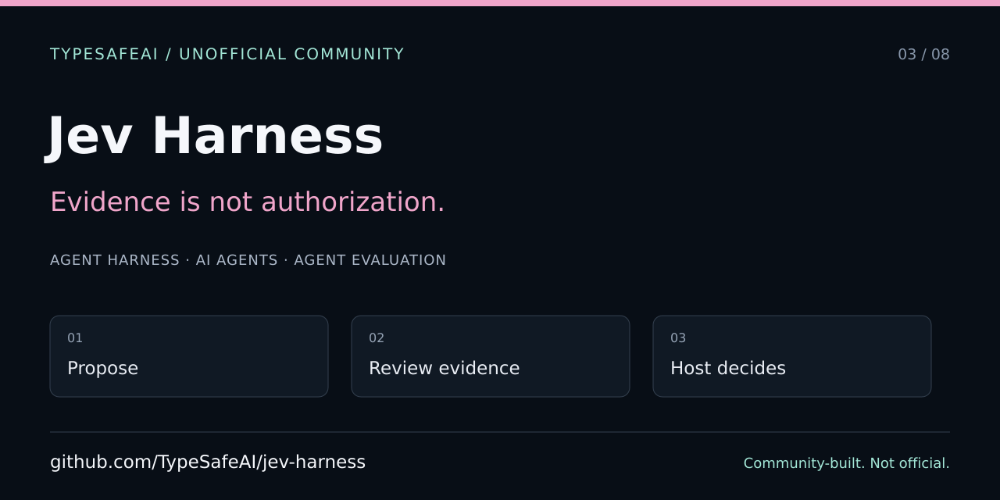

# Jev Harness — developer and agent entry point

> Unofficial TypeSafeAI community project, not an official TypeSafe AI SDK or endorsed production runtime. Community organization created by VC Moderator [@BunsDev](https://github.com/BunsDev).



[Contract and quick start](../../README.md) · [Agent instructions](../../AGENTS.md) · [Contributing](../../CONTRIBUTING.md) · [Architecture](../architecture.md) · [Roadmap](../roadmap.md)

## Start offline

Use Node.js 22+ and the exact pnpm version in `package.json`. Install with `pnpm install --frozen-lockfile`. The offline contract tests and synthetic fixture benchmark do not need a provider key. Keep dependency changes separate from documentation, and preserve the single lockfile and secret guards.

The important boundary is between evidence and authority. Jev supplies narrow judgments; deterministic code produces a review outcome; a host independently decides what it may do. A favorable verdict does not apply a patch, execute proposed code, authenticate a receipt, or grant permissions.

## Project map

| Area | Responsibility |
| --- | --- |
| `src/contract` | Pure proposal validation, question payloads, review mapping, and decision table |
| `src/benchmark` | Synthetic fixture runner and evaluation accounting |
| `fixtures/proposal-review` | Scripted examples, not a validated production benchmark |
| `src/audit/receipt.ts` | Optional receipt binding/replay adapter; a digest is not authentication |
| `src/routing` | Pure closed-set routing policy and evidence contracts |
| `examples/host` | Separately scoped example-host I/O |
| `app`, `components` | Optional Next.js demonstration interface |
| `tests` | Offline contract and adapter tests |

Read [routing guidance](../routing.md) before changing routing behavior. Preserve the pinned model, versioned question semantics, immutable favorable directions, exact verdicts, and typed failure behavior documented in AGENTS.md. Never lower a threshold, widen an option set, or turn a provider failure into success to improve a demonstration.

## Verification

```sh
pnpm typecheck
pnpm test
pnpm check:secrets
pnpm bench:review
pnpm build
```

The build is relevant to the optional Next.js host. Keep automated checks offline and report actual results. Scripted mock totals are not measurements of Jev. Measured claims must link the exact fixture revision, question set, model, command, and run artifact; one run does not establish calibration.

Commits and merges remain subject to the repository's signing and CI requirements. Documentation work does not authorize execution of proposals or external tools.

## Sharing

The SVG is editorial artwork, not a screenshot. Follow [SCREENSHOTS.md](SCREENSHOTS.md) and the [shared publishing checklist](https://github.com/TypeSafeAI/.github/blob/main/docs/discovery/SHARING.md). GitHub About/topics and Social preview are separate settings actions; a committed manifest does not apply them.

Do not invent a hosted demo origin. Share the repository or a confirmed deployment, and never include repository secrets, real private source, familiar memory, or user identity material in a public example. Preserve source-only package status, license attribution, and the host-owned authorization boundary.
