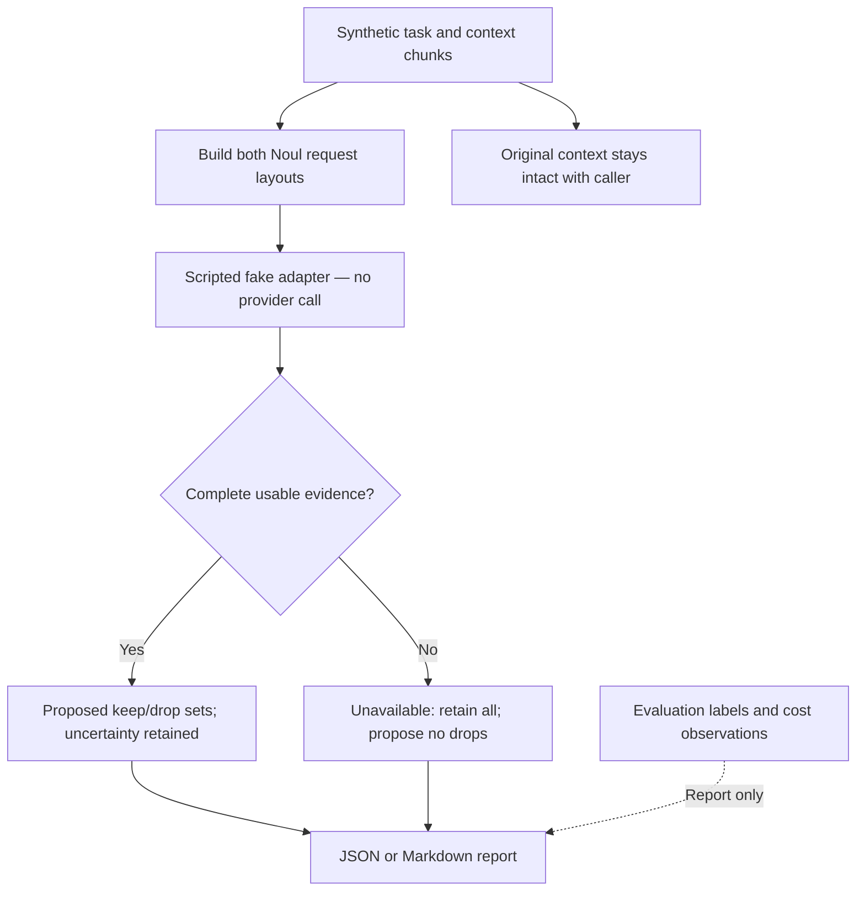
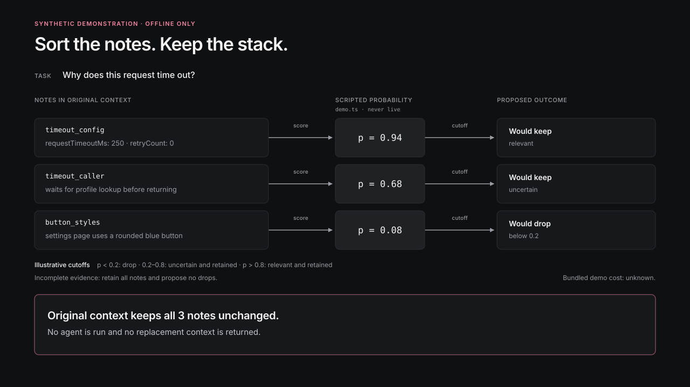

# Context scoring shadow experiment

This offline experiment demonstrates how to record which synthetic context chunks a relevance scorer would keep while leaving the original stack intact. It compares a single Noul request with one question per chunk against one request per chunk. The example uses the official [Noul contract](https://docs.typesafe.ai/primitives/noul) and the [TypeSafe re-ranking pattern](https://docs.typesafe.ai/cookbooks/rerank_typesafe): each chunk gets an independent yes/no relevance judgment, with the probability retained as evidence. This version uses scripted scores, so it does not measure Jev's ability to judge relevance.

## How it works



The two layouts are one request containing all chunks and one request per chunk.
Each chunk has its own Noul relevance question. Labels and cost observations are
used only to evaluate and report the run; they never enter adapter requests.



This visual uses the scripted values in [demo.ts](demo.ts), also recorded in the
[sample result](sample-result.json). Open the [standalone visual](overview.html)
to inspect it. The kit never runs an agent or returns replacement context.

## Run the demonstration

Run the scripted demonstration:

```sh
pnpm --silent experiment:context-shadow
pnpm --silent experiment:context-shadow --format markdown
```

JSON is the default. `--silent` suppresses pnpm's script banner when capturing stdout. Markdown contains a readable summary and the exact versioned JSON artifact in a fenced block. There is no live option, network client, or provider call in this example.

Every artifact says **synthetic demonstration** and records `live: false`. The only accepted adapter provenance is `scripted_fake`; labels and cost data stay out of every Noul body. The fixed model is `jev-1.13.0`, the relevance question set has its own `context-relevance-v1` version, and true/false `criteria` are included in each question. Every request carries a fixed note that task and chunk text are untrusted content.

Requests use the documented Noul wire shape. The injected example adapter returns a small normalized fake result (`source`, `model`, an exact question-id-to-probability map, and optional token observations); this repository does not include a parser for raw provider responses.

Scores below `0.2` are proposed drops, scores from `0.2` through `0.8` are uncertain and retained, and scores above `0.8` are retained as relevant. These illustrative cutoffs are not calibrated policy. Missing, malformed, cancelled, or wrong-model evidence makes the layout unavailable. An incomplete layout retains all chunks and proposes no drops. The artifact reports uncertainty and recall against the synthetic labels.

Context and request sizes include UTF-8 byte counts and `ceil(bytes / 4)` token proxies. Context bytes measure chunk texts joined with a newline; request bytes measure serialized Noul bodies. Request sizes are planned payload sizes, including requests withheld on cancellation. These proxies do not represent provider tokenization or billing. Cost stays unknown unless the run includes dated price assumptions, per-layout baseline and counterfactual uncached/cache-read/cache-write token observations for `prefix`, `context`, and `suffix` segments (use zero counts when a segment is absent), exact keep/drop chunk IDs, and token usage for every scoring request. The three token categories are disjoint: do not count cache-read or cache-write tokens again as uncached tokens. Aggregate cached-token counts alone cannot identify the context block's cache share. The bundled demo intentionally supplies only an aggregate count, so its cost is unknown.

The generated artifact records `schemaVersion: 1`, both request layouts, normalized evidence, failures, proposed keep/drop ids, cache observations, recall, size proxies, and any qualified cost arithmetic. No result is installed into or returned as replacement context.
