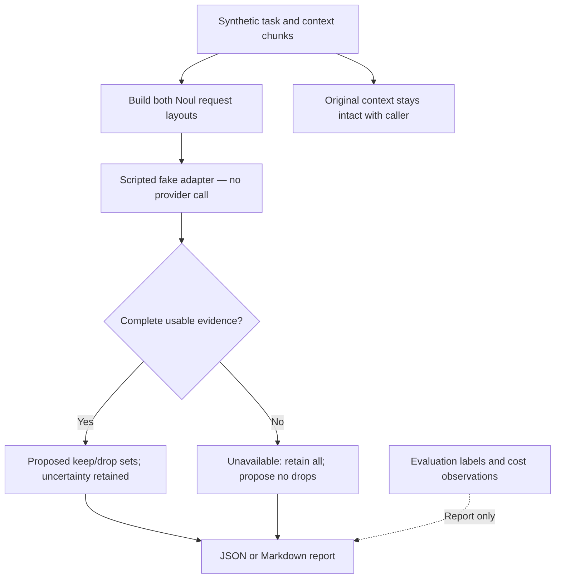
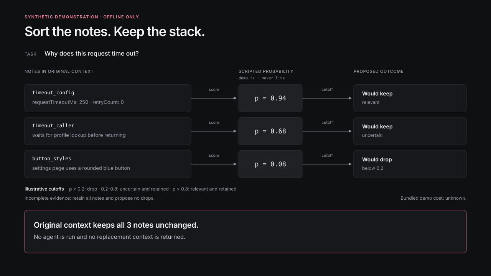

# Context scoring shadow experiment

This offline experiment demonstrates how to record which synthetic context chunks a relevance scorer would keep while leaving the original stack intact. It compares a single Noul request with one question per chunk against one request per chunk. The example uses the official [Noul contract](https://docs.typesafe.ai/primitives/noul) and the [TypeSafe re-ranking pattern](https://docs.typesafe.ai/cookbooks/rerank_typesafe): each chunk gets an independent yes/no relevance judgment, with the probability retained as evidence. This version uses scripted scores, so it does not measure Jev's ability to judge relevance.

## How it works


```mermaid
flowchart TD
    A["Synthetic task and context chunks"] --> B["Build both Noul request layouts"]
    A --> H["Original context stays intact with caller"]
    B --> C["Scripted fake adapter — no provider call"]
    C --> D{"Complete usable evidence?"}
    D -->|Yes| E["Proposed keep/drop sets; uncertainty retained"]
    D -->|No| F["Unavailable: retain all; propose no drops"]
    E --> G["JSON or Markdown report"]
    F --> G
    L["Evaluation labels and cost observations"] -.->|Report only| G
```

The two layouts are one request containing all chunks and one request per chunk.
Each chunk has its own Noul relevance question. Labels and cost observations are
used only to evaluate and report the run; they never enter adapter requests.

In `fan_out`, shared state contains only the task and the untrusted-data note;
each question carries its target chunk's ID and text in structured instructions.
This follows the multi-question [Noul example](https://docs.typesafe.ai/primitives/noul)
that puts a separate candidate in each question's instructions. In `per_chunk`,
the single target chunk sits in that request's state, following the
[reranking example](https://docs.typesafe.ai/cookbooks/rerank_typesafe).
Each chunk's text appears once in the serialized requests for either layout.
These are independent relevance judgments, not an API guarantee that shared
state or sibling questions are hidden from a model. Serialized request sizes
describe these two payload layouts; they do not measure provider token use.
Because `fan_out` keeps chunks out of shared state, it does not test the
documented concern that accuracy falls as unrelated state grows; a packed
shared-state layout remains for a live shadow study (see the
[cost model](../../docs/context-scoring-cost-model.md#data-egress)).



This visual uses the scripted values in [demo.ts](demo.ts), also recorded in the
[sample result](sample-result.json). Open the [standalone visual](overview.html)
to inspect it. The kit never runs an agent or returns replacement context.

## Run the demonstration

Run the scripted demonstration:

```sh
pnpm --silent experiment:context-shadow
pnpm --silent experiment:context-shadow --format markdown
```

JSON is the default. `--silent` suppresses pnpm's script banner when capturing stdout. A leading `--` before the options is accepted, and usage errors exit with status 2. Markdown contains a readable summary and the exact versioned JSON artifact in a fenced block. There is no live option, network client, or provider call in this example.

Every artifact says **synthetic demonstration** and records `live: false`. The only accepted adapter provenance is `scripted_fake`; labels and cost data stay out of every Noul body. The fixed model is `jev-1.13.0`, the relevance question set has its own `context-relevance-v2` version, and true/false `criteria` are included in each question. Every request carries a fixed note that task and chunk text are untrusted content.

Version 2 removes the redundant shared `state.chunks` from the combined request;
version 1 repeated each chunk in shared state and in its question. This changes
the supplied context and size proxies, so the question-set version advances even
though the relevance wording, criteria, thresholds, and model pin are unchanged.
`experimentVersion` tracks the artifact and runner shape; `questionSetVersion`
tracks the effective questions and the context supplied with them.
`context-relevance-v1` was the pre-merge draft published with
[issue #42](https://github.com/TypeSafeAI/jev-harness/issues/42).
The bundled [sample result](sample-result.json) records version 2. `pnpm test`
calls the CLI's `main()` in process and compares its exact JSON output with that
file, so the existing CI test job catches drift. Regenerate it after intentional
changes with
`pnpm --silent experiment:context-shadow > examples/context-scoring-shadow/sample-result.json`.

Requests use the documented Noul wire shape. The injected example adapter returns a small normalized fake result (`source`, `model`, an exact question-id-to-probability map, and optional token observations); this repository does not include a parser for raw provider responses.

Scores below `0.2` are proposed drops, scores from `0.2` through `0.8` are uncertain and retained, and scores above `0.8` are retained as relevant. These illustrative cutoffs are not calibrated policy. Missing, malformed, cancelled, or wrong-model evidence makes the layout unavailable. An incomplete layout retains all chunks and proposes no drops. The artifact reports uncertainty and recall against the synthetic labels.

Keeping every chunk gives perfect recall even if most chunks are irrelevant.
This kit does not report precision, so recall alone cannot justify filtering.
Any later live shadow study still needs an egress review, independently labeled
recall and precision, retained context size, latency, and measured cache costs.
The roadmap's live measurement and integration decisions remain open.

Context and request sizes include UTF-8 byte counts and `ceil(bytes / 4)` token proxies. Context bytes measure chunk texts joined with a newline; request bytes measure serialized Noul bodies. Request sizes are planned payload sizes, including requests withheld on cancellation. These proxies do not represent provider tokenization or billing. Cost stays unknown unless the run includes dated price assumptions; for each request layout, baseline and counterfactual uncached/cache-read/cache-write token counts for `prefix`, `context`, and `suffix` segments (use zero counts when a segment is absent); exact keep/drop chunk IDs; and token usage for every scoring request. Baseline counts are observed on the real, unmodified proposer turn. Counterfactual counts are modeled projections from the kept set under stated `s'` and `X` assumptions (see the [cost model](../../docs/context-scoring-cost-model.md)) until a later paired live run observes them. The baseline is the same proposer turn whichever request layout is scored, so if both layouts supply baseline segments and they differ, cost is unknown. Cost inputs are copied with JSON semantics before the first await: values JSON cannot represent are dropped or converted as `JSON.stringify` does (for example, `NaN` becomes `null`), and an invalid aggregate count is omitted. Malformed values are recorded as supplied and give an unknown cost rather than failing the run. The three token categories are disjoint: do not count cache-read or cache-write tokens again as uncached tokens. Aggregate cached-token counts alone cannot identify the context block's cache share. The bundled demo supplies no price assumptions and only an aggregate cached-token count, so its recorded cost is unknown because dated price assumptions are missing; tests cover the aggregate-only case with price assumptions supplied.

Net savings are baseline proposer cost minus counterfactual proposer cost and scoring cost, so a positive value means scoring is cheaper; they exclude the cost of recall errors and added latency. In an unavailable layout, per-chunk classifications are recorded evidence, not drop recommendations.

The generated artifact records `schemaVersion: 1`, both request layouts, normalized evidence, failures, proposed keep/drop ids, cache observations, recall, size proxies, and any qualified cost arithmetic. No result is installed into or returned as replacement context.
